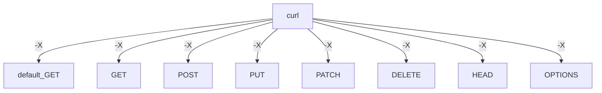

```mermaid
flowchart TB

curl --"-X"--> default_GET
curl --"-X"--> GET
curl --"-X"--> POST
curl --"-X"--> PUT
curl --"-X"--> PATCH
curl --"-X"--> DELETE
curl --"-X"--> HEAD
curl --"-X"--> OPTIONS
```

not: buyuk X.

