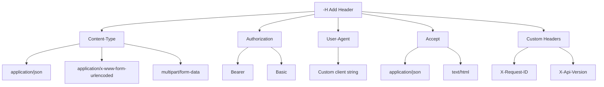

```mermaid

graph TD
    A[-H Add Header] --> B["Content-Type"]
    B --> B1["application/json"]
    B --> B2["application/x-www-form-urlencoded"]
    B --> B3["multipart/form-data"]

    A --> C["Authorization"]
    C --> C1["Bearer <token>"]
    C --> C2["Basic <base64(user:pass)>"]

    A --> D["User-Agent"]
    D --> D1["Custom client string"]

    A --> E["Accept"]
    E --> E1["application/json"]
    E --> E2["text/html"]

    A --> F["Custom Headers"]
    F --> F1["X-Request-ID"]
    F --> F2["X-Api-Version"]

```
