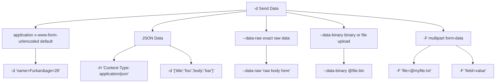

```mermaid
graph TD
    A[-d Send Data] --> B[application x-www-form-urlencoded default]
    B --> B1["-d 'name=Furkan&age=28'"]

    A --> C[JSON Data]
    C --> C1["-H 'Content-Type: application/json'"]
    C --> C2["-d '{'title':'foo','body':'bar'}'"]

    A --> D[--data-raw exact raw data]
    D --> D1["--data-raw 'raw body here'"]

    A --> E[--data-binary binary or file upload]
    E --> E1["--data-binary @file.bin"]

    A --> F[-F multipart form-data]
    F --> F1["-F 'file=@myfile.txt'"]
    F --> F2["-F 'field=value'"]
```
